# Iris Data Assignment

---

### **Purpose**

- Practice end-to-end data analysis using **Pandas** and **Matplotlib**.
- Understand the **Iris dataset** structure (features and labels).
- Perform exploratory data analysis, create subsets, and visualize distributions.
- Document insights and interpretations as if preparing for a real ML workflow.

---

### **Problem Description**

The **Iris dataset** is a classic machine learning dataset with **150 samples** of iris flowers, each described by 4 numeric features:

- Sepal length
- Sepal width
- Petal length
- Petal width

The target variable is the **species** (Setosa, Versicolor, Virginica).  
This project walks through **data acquisition → exploration → visualization → interpretation**.

---

## Assignments

### **[Problem 1] Data Acquisition**

- Load the Iris dataset using `sklearn.datasets`.
- Separate into **features (X)** and **labels (y)**.
- Save as:
  - `data/iris_features.csv`
  - `data/iris_labels.csv`

---

### **[Problem 2] Data Combination**

- Merge features and labels into a single DataFrame.
- Save as:
  - `data/iris_combined.csv`

**Shape:** (150, 5).

---

### **[Problem 3] Data Checking**

- Print a single sample for inspection.
- Count label occurrences.
- Check for missing values.
- Generate summary statistics.
- Save as:
  - `data/iris_data_report.txt`

---

### **[Problem 4] Dataset Research (Discussion)**

- Dataset background:
  - Introduced by **Ronald A. Fisher (1936)**.
  - Widely used for **classification and clustering tasks**.
  - Features are continuous and relatively balanced across classes.
  
  - [`iris_dataset_info.md`](data/iris_dataset_info.md)

---

### **[Problem 5] Feature Extraction**

- Extracted subsets of the dataset:
  1. Entire `sepal_width` column.
  2. Rows 50–99 (all columns).
  3. Rows 50–99 (only `petal_length`).
  4. All rows where `petal_width == 0.2`.
- Saved as:
  - `data/subset_sepal_width.csv`
  - `data/subset_rows_50_99.csv`
  - `data/subset_rows_50_99_petal_length.csv`
  - `data/subset_petal_width_eq_0.2.csv`

---

### **[Problem 6] Visualization**

- Plots generated and saved in `plots/`:  
  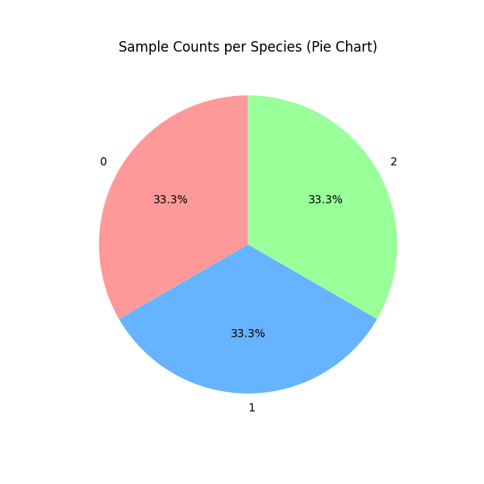  
  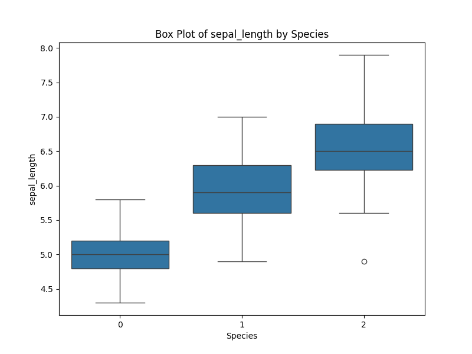  
  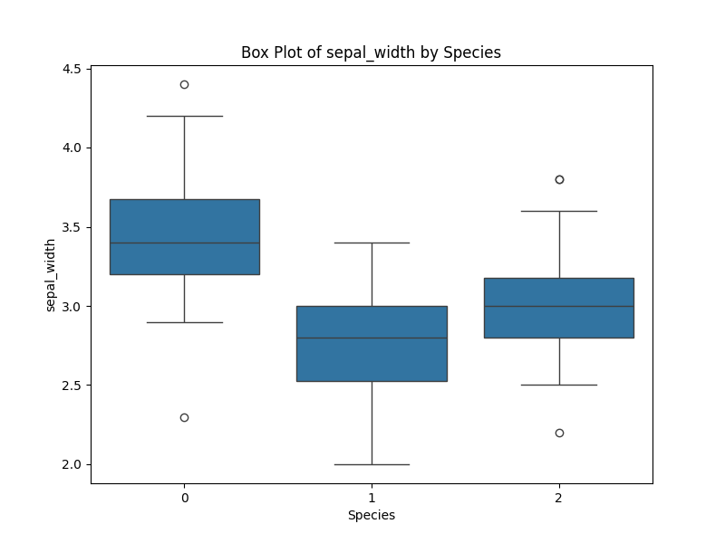  
  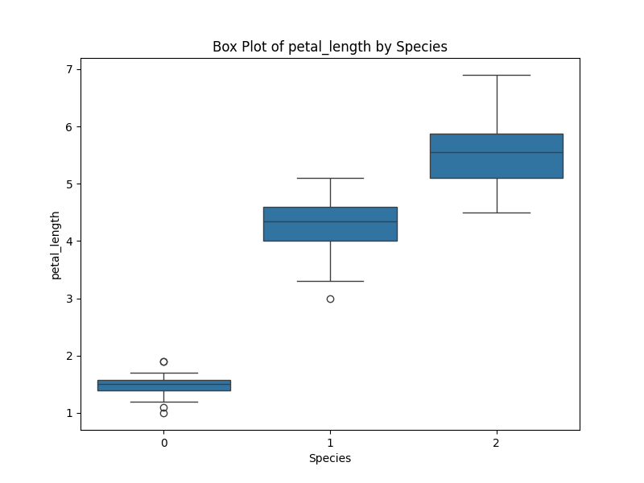  
  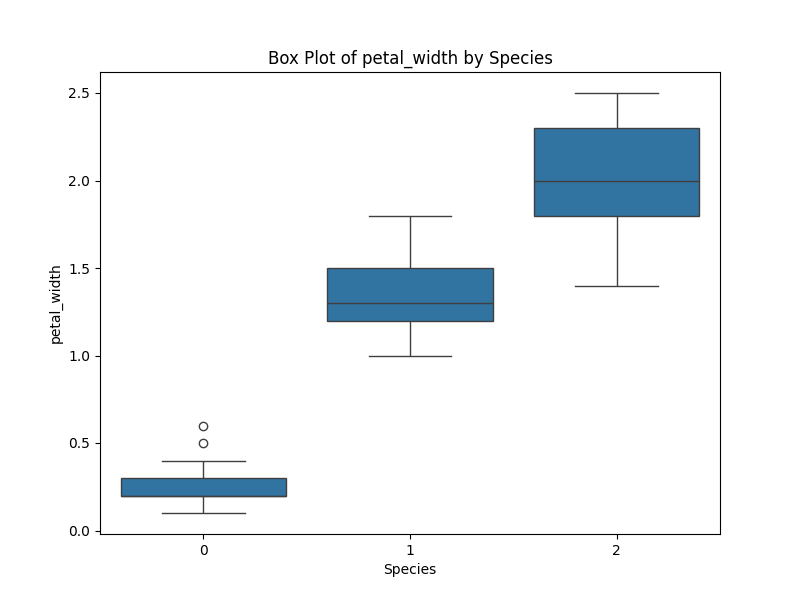  
  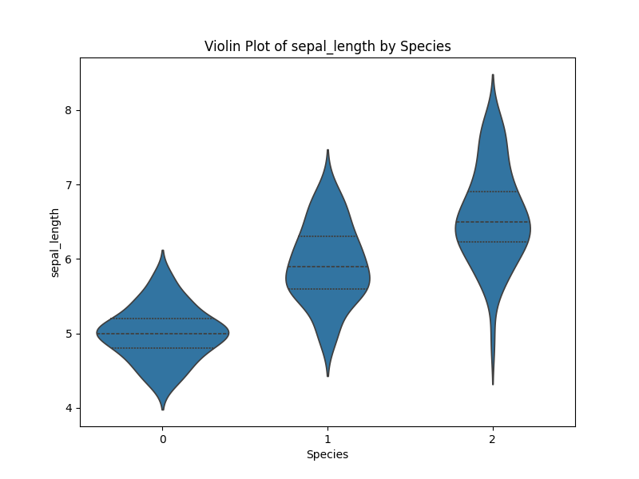  
  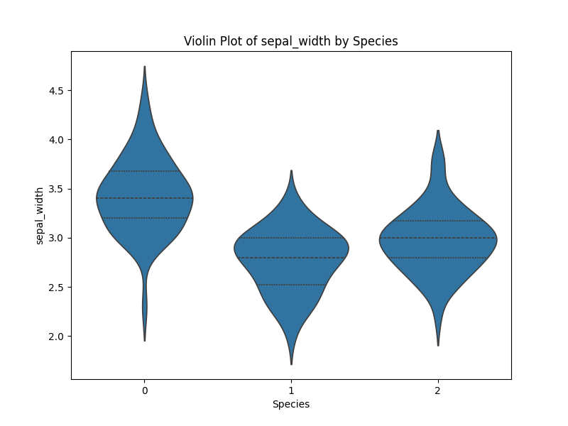  
  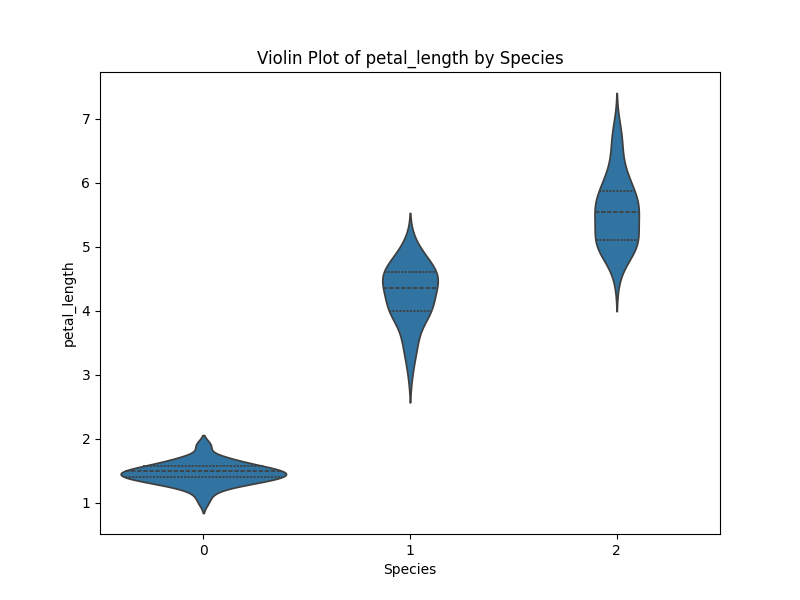  
  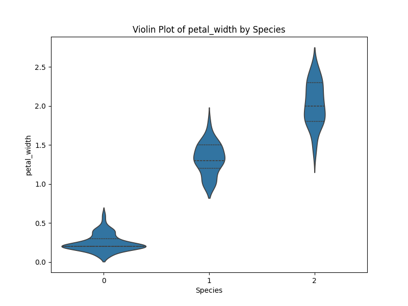

---

### **[Problem 7] Feature Relationships**

- Pairwise feature relationships plotted and saved in `plots/`:  
  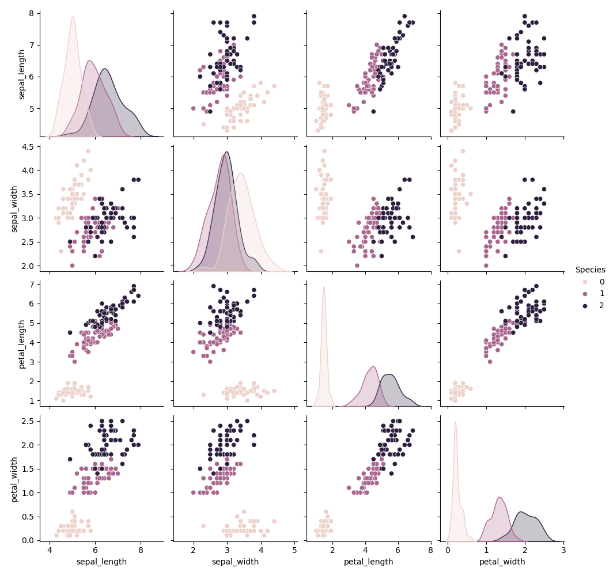  
  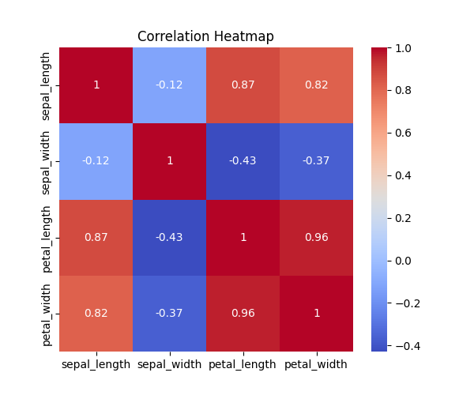  
  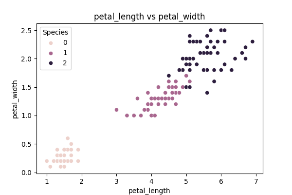
  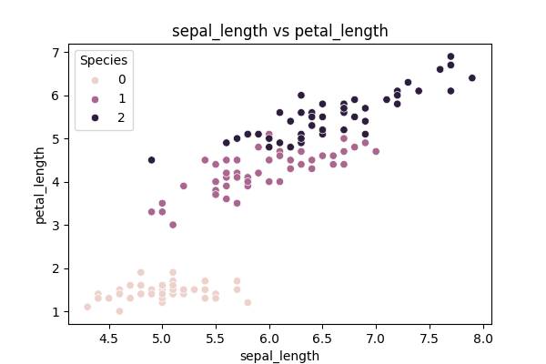
  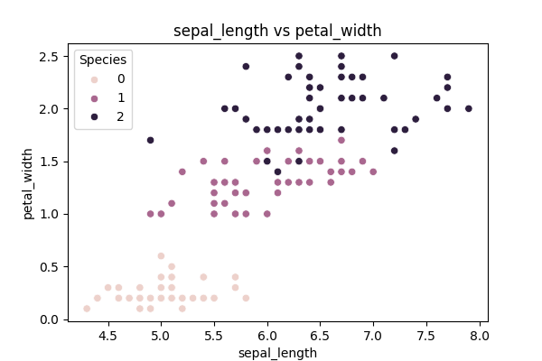
  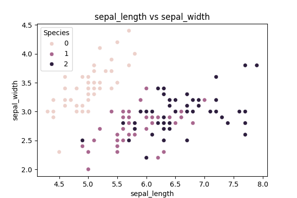
  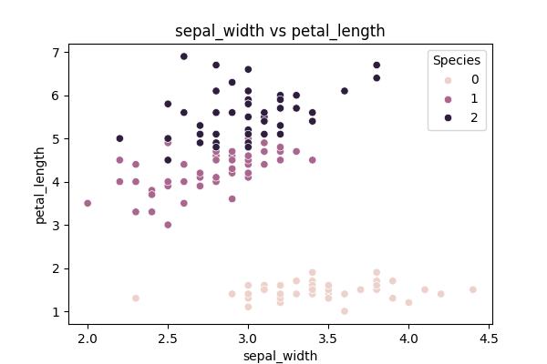
  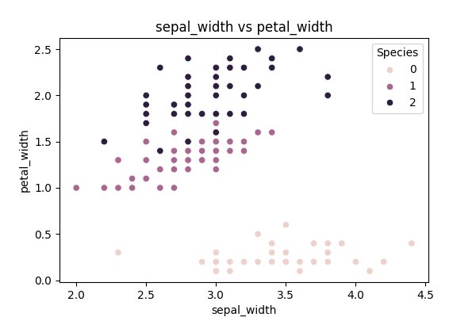

---

### **[Problem 8] Analysis & Interpretation (Discussion)**

- Observations:
  - **Setosa**: clearly separable (small, narrow petals).
  - **Versicolor** vs **Virginica**: overlap but Virginica generally has larger petals.
  - Sepal features: weaker for separation than petal features.
- Interpretations saved as:
  - [`results_discussion.md`](data/results_discussion.md)

### **Tools Used**

- Python
- Pandas
- Matplotlib / Seaborn
- Scikit-learn

---

### **How to Run**

1. Clone the repository or download the files.
2. Navigate into the project directory.
3. Run all tasks with:
   ```bash
   python main.py
   ```

#### **Individual problems can also be run separately:**

python problem1_data_acquisition.py
python problem2_combine_data.py
...
python problem8_analysis_interpretation.py


## Author

**Assignment:** Iris Data Assignment

**Name:** Victor Karisa

**Date:** 01/10/2025
